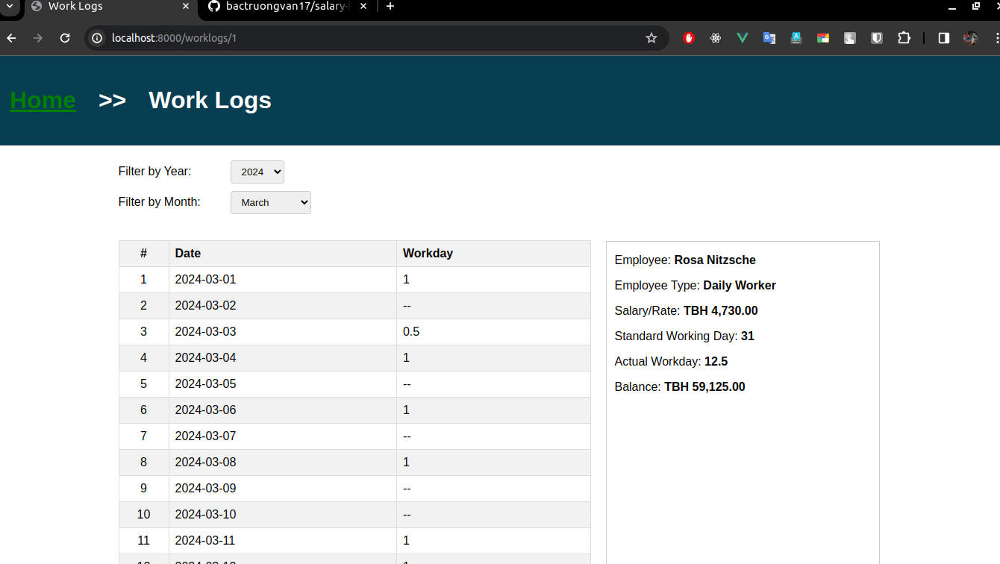

# Salary Hero

One of the missions of Salary Hero is to improve the financial wellness of workers in Thailand.
Many times, there can be an expectedly urgent situation where one really needs to se the money.
Instead of waiting until the end of the month for his salary, the worker can make a request to
Salary Hero!

For Salary Hero to be able to determine how much each user can withdraw, their balances must be
calculated once on a daily basis to reflect the days they have been working in the month. An
example is if I am a monthly salary rate worker and my base salary is THB 30,000/month and I have
been working for 10 days, I should have a balance of THB 10,000. And on the next day, my balance
should be THB 11,000.

## Table of Contents

- [Requirements](#requirements)
- [Project Structure](#project-structure)
- [Database Schema](#database-schema)
- [Installation](#installation)
- [Demo Pictures](#demo-pictures)

## Requirements

Before setting up Salary Hero, ensure you have the following prerequisites installed:

- Docker (version 25 or higher)
- Docker compose (version v2.24 or higher)
- Node.js (version 20 or higher)
- npm (Node Package Manager)
- MYSQL (version 5.7)

## Project Structure


- `app/`: Contains the source code of the application.
    - `spec/`: Jasmine configuaration for unit test
    - `src/`: Source code of the application.
        - `console/`: Setup crontab and commands run in background.
        - `constants`: Define constants used in the entire project.
        - `controllers/`: Controllers responsible for handling HTTP requests.
        - `errors`: Define custom errors.
        - `models/`: Database models and schemas + Config database connection.
        - `public/`: Define static files.
        - `repositories/`: Repositories for entities.
        - `response/`: Define response structures to client and transformation functions.
        - `routes/`: Express routes.
        - `services/`: Business logic and services.
        - `utils/`: Utility functions.
        - `tests/`: Units test for app.
        - `views/`: Pug view files.
        - `index.ts`: Entry point of the application.
    - `package.json`: Node.js package file
    - `tsconfig.json`: Typescript configuartion file
- `.env.example`: Example environment configuration file.
- `docker-compose.yaml`: Docker compose file for development environment.

## Database Schema

The database schema for Salary Hero includes tables for storing employee information and work logs of employees. Here's a simplified overview:


- `employees`: Stores employee information.
    - `id`: employee id
    - `name`: employee name
    - `type`: employee type: Monthly Worker or Daily Worker
    - `salary`: base salary for monthly worker and daily rate for Daily worker
    - `currency`: employee's currency
    - `balance`: current employee's balance in this month (day - 1)
    - `date_start_work`: Employee's date start work
- `work_logs`: Stores work logs of employee each day.
    - `employee_id`: employee id
    - `curr_emp_type`: current employee type in log time (case employee switch between Monthly <-> Daily)
    - `curr_salary`: current employee salary in log time (case salary of employee is changed)
    - `work_duration`: FullDay or HalfDay
    - `log_time`: day of logging.


## Installation (for only development)

Follow these steps to install and set up Salary Hero:

1. First, make sure Docker is running:

   ``` bash
   docker ps
   docker compose ps 
2. Clone the repository:

   ```bash
   git clone https://github.com/bactruongvan17/salary-hero
3. Copy .env.example to .env

    ```bash
    cd salary-hero
    cp .env.example .env
4. Edit .env file

    ```bash
    MYSQLDB_ROOT_PASSWORD=your_database_password
    MYSQLDB_DATABASE=your_database_name
    MYSQLDB_USER=your_database_user
    MYSQLDB_DOCKER_PORT=3306

    APP_LOCAL_PORT=your_docker_host_port
5. Start docker

    ```bash
    docker compose up -d
6. Install node packages dependency

    ```bash
    docker compose exec app npm install
7. Start application

    ```bash
    docker compose exec app npm run dev
    Open brower: http://localhost:{your_host_port}
8. Run tests

    ```
    docker compose exec app npn run test
9. Run lint

    ```
    docker compose exec app npn run lint
    docker compose exec app npn run lint:fix
10. Run format code

    ```
    docker compose exec app npn run prettier
    docker compose exec app npn run prettier:fix
11. Fake data to tests

    ```
    curl -X POST localhost:{your_host_port}/fake-employee
    curl -X POST localhost:{your_host_port}/fake-work-logs
## Demo Picture


